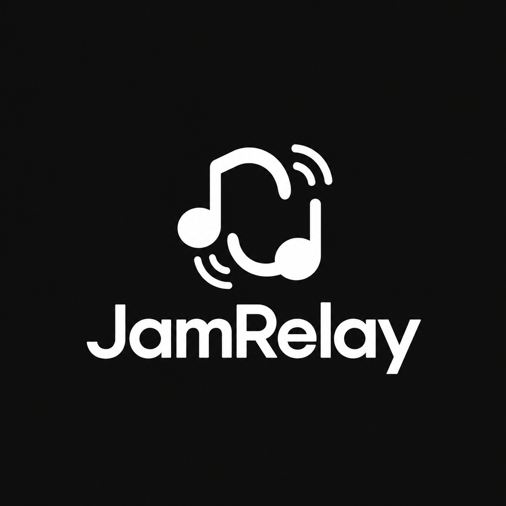
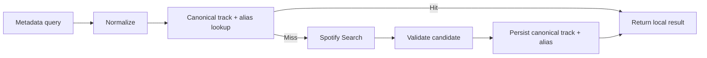
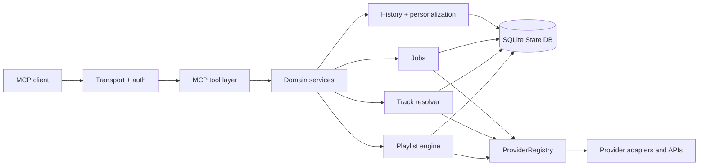

<div align="center">

<picture>
  <source media="(prefers-color-scheme: dark)" srcset="assets/logos/jamrelay-logo-dark.png.png">
  <source media="(prefers-color-scheme: light)" srcset="assets/logos/jamrelay-logo-light.png.png">
  
</picture>

<br>

### Self-hosted music automation for your Spotify account.

Turn high-level requests into deterministic, inspectable and reversible music operations through MCP.

<br>

[](https://github.com/makkiattooo/JamRelay/releases/latest)
[](LICENSE)
[](package.json)
[](docs/mcp-client.md)
[](docs/getting-started.md)

[Get started](docs/getting-started.md) ·
[Documentation](docs/index.md) ·
[MCP tools](docs/tools-reference.md) ·
[Latest release](https://github.com/makkiattooo/JamRelay/releases/latest)

</div>

---

## What is JamRelay?

JamRelay is a **self-hosted music automation engine** that connects MCP clients to Spotify while adding a stateful automation layer on top of the raw API.

JamRelay is a provider-neutral MCP music automation server. It can persist local state, resolve known tracks without repeated catalog calls, analyze playlists, plan mutations, preview them, snapshot state, execute bounded changes, verify the result, resume jobs after restarts and derive local personalization signals from events it actually observed.

The goal is not to make an AI client manually coordinate hundreds of Spotify API requests.

The goal is:

```text
request
   ↓
analyze state
   ↓
build deterministic plan
   ↓
preview / dry run
   ↓
snapshot
   ↓
execute bounded Spotify operations
   ↓
verify
   ↓
record state
```

JamRelay handles the automation layer in between.

---

## Why JamRelay?

### Music automation instead of API plumbing

High-level behavior lives in JamRelay rather than in an AI client's conversation context.

Examples include:

- smart playlist reordering,
- artist balancing and spacing,
- semantic deduplication,
- playlist merge/split/clone/sync,
- reusable rules and recipes,
- playlist personalization,
- session queue planning,
- recurring rotations,
- durable bulk operations.

### Plan before changing

Complex playlist mutations are designed around:

```text
ANALYZE → PLAN → DRY RUN → SNAPSHOT → EXECUTE → VERIFY → RECORD
```

Smart mutations use dry-run-first behavior where supported. JamRelay can preserve ordered playlist snapshots before a change and verify the resulting playlist afterwards.

### Database-first track resolution

JamRelay does not immediately call Spotify Search for every metadata lookup.

```text
metadata query
   ↓
normalize
   ↓
local canonical / alias lookup
   ├── hit  → return local result
   └── miss → Spotify Search → validate → persist
```

Known tracks can resolve locally. Ambiguous or low-confidence matches are not blindly cached.

### Persistent local state

JamRelay stores durable application state in SQLite, including:

- canonical tracks and aliases,
- resolver attempts,
- API errors and rate limits,
- durable jobs,
- playlist snapshots and operations,
- playlist recipes,
- locally observed listening events,
- playlist rotations.

This is application state, not temporary chat memory.

### Explainable personalization

JamRelay does not claim to know Spotify's private recommendation model or a user's complete listening history.

Personalization is derived from evidence JamRelay actually has, with observed facts kept separate from derived scores.

---

## Core capabilities

| Area                     | Examples                                                                  |
| ------------------------ | ------------------------------------------------------------------------- |
| **Spotify access**       | Search, tracks, artists, albums, playlists, library, playback, devices    |
| **Track resolution**     | DB-first lookup, aliases, ambiguity handling, alternate resolver fallback |
| **Playlist analysis**    | Health reports, duration, concentration, duplicates, repetition           |
| **Playlist layout**      | Smart shuffle, artist balancing, artist/album gaps, smart insertion       |
| **Playlist cleanup**     | Exact/semantic dedupe, filters, artist limits                             |
| **Playlist composition** | Merge, split, clone, sync, extract, move, replace                         |
| **Safety**               | Dry runs, plans, snapshots, verification, restore, undo                   |
| **Automation**           | Rules, recipes, bulk operations, optimization                             |
| **State**                | SQLite persistence, migrations, diagnostics, error history                |
| **Jobs**                 | Durable execution, retry state, resume, cancel, commit                    |
| **History**              | Locally observed listening events with provenance                         |
| **Personalization**      | Affinity ranking, recent-play avoidance, rediscovery, deep cuts           |
| **Sessions**             | Session queues, duration targets, artist spacing, smart next              |
| **Rotations**            | Daily mixes, weekly rotations, persistent schedules                       |

The exact MCP surface is generated from the runtime registry.

See [`docs/tools-reference.md`](docs/tools-reference.md) for the canonical tool reference.

---

## Example: improve a playlist safely

A request such as:

> Improve this playlist without changing which songs are in it. Spread artists and albums out, preview the changes first, then verify the result.

can become:

```text
playlist health report
        ↓
deterministic optimization plan
        ↓
dry run
        ↓
safety snapshot
        ↓
apply ordering changes
        ↓
capture resulting state
        ↓
verify ordered playlist contents
```

The playlist engine can preserve the original track set while changing only the layout.

---

## Playlist automation

JamRelay's playlist engine works on normalized tracks and serializable operation plans.

### Analysis

- health reports
- duration
- artist/album concentration
- adjacent-artist repetition
- exact duplicate detection
- conservative semantic duplicate detection
- unavailable-item detection

### Layout

- deterministic seeded shuffle
- artist and album spacing
- artist balancing
- artist-share limits
- smart insertion
- affinity ordering

### Cleanup and composition

- exact/semantic deduplication
- typed filtering
- artist removal/replacement
- merge/split/clone/sync
- extract and move artist tracks
- duration-based trimming/extension

### Automation

- reusable typed rules
- persistent recipes
- optimization plans
- bulk editing
- recurring rotations
- daily and weekly playlist workflows

Read more in [Playlist automation](docs/playlist-automation.md).

---

## Safety model

Spotify writes are external network operations, not one cross-request ACID transaction.

JamRelay does not pretend otherwise.

Before supported complex mutations it can preserve ordered URIs, playlist metadata, Spotify snapshot identifiers when available and operation metadata. After writes, it can verify the actual resulting playlist.

If a multi-request operation partially fails, that partial state is surfaced explicitly.

Undo applies only to supported JamRelay-managed reversible operations.

See [Playlist safety, snapshots and undo](docs/playlist-safety.md).

---

## Database-first resolution



Spotify responses can passively warm canonical state. When Spotify Search is rate-limited, cached matches remain available.

An optional alternate resolver may provide candidate Spotify IDs or URLs, but JamRelay validates accepted candidates against Spotify before treating them as canonical.

See [Database-first track resolution](docs/database-first-resolution.md).

---

## State database

JamRelay uses SQLite for durable local application state.

Forward-only SQL migrations are applied automatically at startup. Applied migrations are recorded with version, SHA-256 checksum, provenance and application timestamp, and are verified on future startups.

JamRelay rejects inconsistent migration histories instead of silently continuing.

The health endpoint exposes schema state:

```json
{
  "database": {
    "status": "ok",
    "schemaVersion": "0004_personalization_history.sql",
    "expectedVersion": "0004_personalization_history.sql",
    "schemaState": "current"
  }
}
```

See [State Database](docs/state-database.md).

---

## Quick start

### Requirements

- Node.js 22.13+ or Docker
- Spotify Developer application
- Spotify account
- callback URL you control

Some playback operations may require Spotify Premium and an active compatible device.

### Clone and install

```bash
git clone https://github.com/makkiattooo/JamRelay.git
cd JamRelay
npm ci
```

Create `.env`:

```bash
cp .env.example .env
```

PowerShell:

```powershell
Copy-Item .env.example .env
```

Generate an encryption key:

```bash
node -e "console.log(require('crypto').randomBytes(32).toString('base64'))"
```

Configure at minimum:

```env
SPOTIFY_CLIENT_ID=
SPOTIFY_CLIENT_SECRET=
TOKEN_ENCRYPTION_KEY=
PUBLIC_BASE_URL=http://127.0.0.1:5267
```

Start:

```bash
npm run dev
```

Authorize Spotify:

```text
http://127.0.0.1:5267/auth/providers/spotify/start
```

Check:

```text
http://127.0.0.1:5267/auth/status
http://127.0.0.1:5267/health
```

Local MCP endpoint:

```text
http://127.0.0.1:5267/mcp
```

For remote deployments, expose the MCP endpoint through HTTPS and configure Bearer auth or MCP OAuth.

---

## MCP clients

JamRelay uses MCP Streamable HTTP and includes setup notes for:

- ChatGPT
- Claude
- Gemini CLI
- Cursor
- VS Code / Copilot
- Windsurf
- MCP Inspector

Automated MCP protocol tests cover the server surface. Live third-party client
verification remains a manual release-owner check for each target client.

See [Connect clients](docs/clients/index.md) and [MCP OAuth registration](docs/clients/oauth-compatibility.md).

---

## Authentication

JamRelay has two separate authorization boundaries:

### Spotify authorization

Spotify OAuth grants JamRelay permission to operate on the connected Spotify account.

### MCP client authorization

MCP auth controls which clients may access JamRelay.

Supported mechanisms include:

- OAuth 2.0 Authorization Code
- PKCE
- static OAuth clients
- multiple OAuth clients
- RFC 7591 Dynamic Client Registration
- public and confidential clients
- optional static Bearer auth

---

## Docker and deployment

JamRelay supports Docker and Docker Compose.

Persistent state lives under:

```text
/data
```

Production Compose deployments use the external `jamrelay_data` volume so recreating the application container does not destroy state.

The production container is designed around:

- non-root execution,
- read-only root filesystem,
- dropped Linux capabilities,
- `no-new-privileges`,
- writable `/tmp`,
- explicit internal networking.

The VPS deployment workflow includes local checks, build verification, tarball upload, Compose validation, image build, controlled replacement, schema verification, health-gated rollout, public endpoint checks and rollback support.

See:

- [Installation](docs/installation.md)
- [Operations](docs/operations.md)
- [Free hosting](docs/deployment/free-hosting.md)
- [Low-cost deployment](docs/deployment/budget-hosting.md)

---

## Development

```bash
npm ci
npm run dev
```

Useful checks:

```bash
npm run format
npm run format:check
npm run lint
npm run typecheck
npm test
npm run build
npm run docs:generate
npm run docs:check
npm run docs:build
```

Full verification:

```bash
npm run check
```

Release gate:

```bash
npm run release:check
```

---

## Documentation

The VitePress documentation is the primary technical documentation.

- [English](docs/index.md) — canonical
- [Polski](docs/pl/index.md) — high priority
- [Deutsch](docs/de/index.md) — best effort
- [Français](docs/fr/index.md) — best effort
- [Español](docs/es/index.md) — best effort

Fast-changing references are generated from project sources with:

```bash
npm run docs:generate
```

---

## Architecture



JamRelay's MCP tools are an interface to this architecture, not the architecture itself.

See [Architecture](docs/architecture.md).

The multi-provider execution, synchronization and release audit is documented in [Release audit](docs/release-audit.md).

---

## Privacy and security

JamRelay is self-hosted. By default, state such as OAuth data, canonical track mappings, playlist snapshots, job state, local history and derived personalization signals stays inside your deployment.

Do not expose JamRelay publicly without authentication.

Keep `.env`, client secrets, token stores, MCP secrets, `/data` and database backups outside version control and public web roots.

Use HTTPS for remote deployments.

See [SECURITY.md](SECURITY.md) and [Security documentation](docs/security.md).

---

## Contributing

Contributions are welcome.

Before submitting changes:

```bash
npm run check
```

Read:

- [CONTRIBUTING.md](CONTRIBUTING.md)
- [CLA.md](CLA.md)
- [LICENSING.md](LICENSING.md)

---

## Releases

Latest release:

[**JamRelay v1.1.0 — Stateful Music Automation**](https://github.com/makkiattooo/JamRelay/releases/tag/v1.1.0)

See [CHANGELOG.md](CHANGELOG.md) for release history.

---

## License

JamRelay is licensed under the **GNU Affero General Public License v3.0 only (`AGPL-3.0-only`)**.

See [LICENSE](LICENSE) and [LICENSING.md](LICENSING.md).

---

## Disclaimer

JamRelay is an independent open-source project.

It is not affiliated with, endorsed by, sponsored by, or an official product of Spotify, OpenAI, Anthropic, Google, Microsoft, Cursor, Windsurf, or any other platform or vendor referenced by the project.

Spotify and other product names and trademarks belong to their respective owners.

---

<div align="center">

**Music automation you can run yourself.**

</div>
