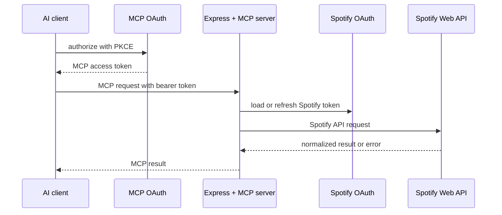

# Architecture

The server starts from `src/index.ts`, registers the tools in `src/mcp/tools.ts` and `src/mcp/helpers.ts`, and delegates Spotify calls to `src/spotify/client.ts`. Spotify OAuth is implemented in `src/spotify/auth.ts`; encrypted token persistence is in `src/spotify/token-store.ts`; MCP OAuth persistence and routes are in `src/mcp/oauth.ts`.

The MCP endpoint is stateless at the transport layer. Runtime state is limited to encrypted Spotify credentials and the MCP OAuth store. Do not share either store between unrelated deployments.

## Request lifecycle

1. Express parses a bounded request body and adds browser-hardening headers.
2. `/mcp` checks the bearer API key with a timing-safe comparison or validates the MCP OAuth token digest.
3. The MCP handler creates a server instance and exposes the registered tools.
4. A tool validates its input schema and maps IDs/URIs to Spotify paths.
5. `SpotifyClient` obtains an access token, sends a request with a 30-second timeout, and normalizes the response.
6. Safe GET requests may retry 429 and 5xx responses with bounded backoff; writes are not automatically retried.
7. The tool returns compact, JSON-serializable data. Spotify credentials are never part of the result.

## State and trust boundaries

| Boundary             | Data crossing it                                    | Main control                              |
| -------------------- | --------------------------------------------------- | ----------------------------------------- |
| AI client → `/mcp`   | JSON-RPC and tool arguments                         | Bearer API key or MCP OAuth               |
| Browser → MCP OAuth  | Client ID, redirect, PKCE challenge, owner approval | Exact allowlist, S256, rate limit         |
| Browser → Spotify    | Authorization code and state                        | Spotify OAuth and one-time state          |
| Server → Spotify API | Access token and API request                        | Encrypted refreshable token store         |
| Server → filesystem  | Encrypted tokens and hashed MCP records             | Atomic writes and restrictive permissions |

The server is single-user from Spotify's perspective: one configured Spotify authorization is used by all authorized MCP clients. Do not expose one deployment to unrelated users unless you add a separate tenancy model.
