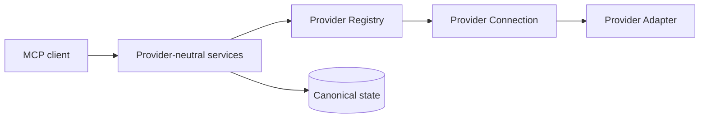
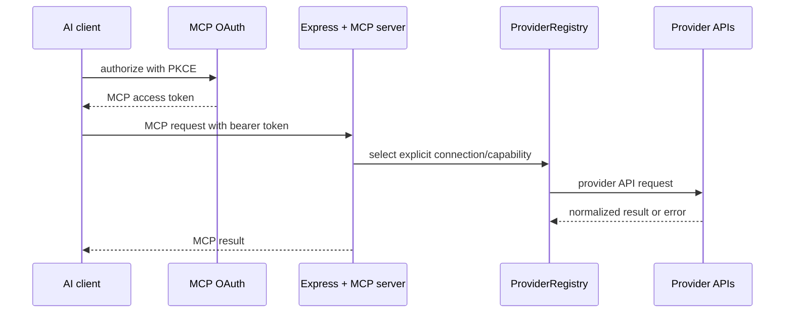

# Architecture

JamRelay is provider-neutral. MCP requests reach shared services, which select
a capable `ProviderConnection` through the registry; canonical entities and
SQLite state remain independent of provider IDs. Spotify is one adapter, not a
boot or health prerequisite.

The server starts from `src/index.ts`, registers one provider-neutral MCP surface in `src/mcp/tools.ts` and `src/mcp/helpers.ts`, and resolves provider capabilities through `src/providers/registry.ts`. Spotify remains the reference adapter under `src/spotify/`; SoundCloud is an additive adapter under `src/soundcloud/`. Provider OAuth and encrypted credential stores remain separate from MCP OAuth in `src/mcp/oauth.ts`.

The owner-facing Connection Hub is a separate control plane: provider OAuth
manages credentials and connection lifecycle, while MCP OAuth manages a client
grant over selected connection IDs and granular operation permissions. The MCP
request path enforces that grant before provider routing.

The MCP endpoint is stateless at the transport layer. Durable state includes the SQLite State DB plus the encrypted Spotify credentials and MCP OAuth store. The database is documented in [State Database](/state-database); do not share any of these stores between unrelated deployments.

## Request lifecycle

1. Express parses a bounded request body and adds browser-hardening headers.
2. `/mcp` checks the bearer API key with a timing-safe comparison or validates the MCP OAuth token digest.
3. The MCP handler creates a server instance and exposes the registered tools.
4. A tool validates its input schema and selects an explicit provider connection when a write is requested.
5. The selected provider adapter obtains credentials, sends a bounded request, and normalizes the response.
6. Safe GET requests may retry 429 and 5xx responses with bounded backoff; writes are not automatically retried.
7. The tool returns compact, JSON-serializable data. Spotify credentials are never part of the result.

## State and trust boundaries

| Boundary             | Data crossing it                                    | Main control                              |
| -------------------- | --------------------------------------------------- | ----------------------------------------- |
| AI client → `/mcp`   | JSON-RPC and tool arguments                         | Bearer API key or MCP OAuth               |
| Browser → MCP OAuth  | Client ID, redirect, PKCE challenge, owner approval | Exact allowlist, S256, rate limit         |
| Browser → Spotify    | Authorization code and state                        | Spotify OAuth and one-time state          |
| Server → Spotify API | Access token and API request                        | Encrypted refreshable token store         |
| Server → filesystem  | Encrypted tokens and hashed MCP records             | Atomic writes and restrictive permissions |

Each configured provider connection is scoped independently. A deployment may have Spotify, SoundCloud and Apple Music connections, but credentials, capabilities, snapshots, rate limits and writes remain connection-scoped. Apple Music's Developer Token and Music User Token are distinct credentials, and neither is MCP OAuth. Do not expose one deployment to unrelated users unless you add a separate tenancy model.

## Transfer safety

Transfer planning is always dry-run and stores an immutable fingerprint of mapping decisions. Execution requires an explicit destination connection and confirmation, snapshots the destination before mutation, delegates writes to `PlaylistGateway`, records per-item outcomes, and verifies the resulting playlist. Mirror and remove-extra sync fail closed when source items are ambiguous or unresolved; append-missing and two-way union do not infer destructive cross-provider equivalence.
