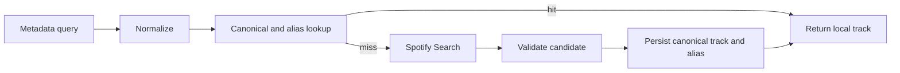

# Database-first track resolution

Metadata-based resolution follows one path:

`TrackResolver` normalizes title, artist and album, then calls `findCachedTrack`. A hit returns immediately and does not call Spotify Search. A miss may search Spotify, validate candidates, and persist the result through `upsertTrackAndAlias`.

Spotify responses also passively warm canonical state through `indexCanonicalTrack`. Ambiguous or low-confidence matches are not blindly cached. Search rate limiting can use the configured alternate resolver while cached hits continue to work.

The `tracks` table stores canonical identity; `track_aliases` stores normalized lookup forms and hit counters. This is persistent application state, not a second cache owned by playlist features.
