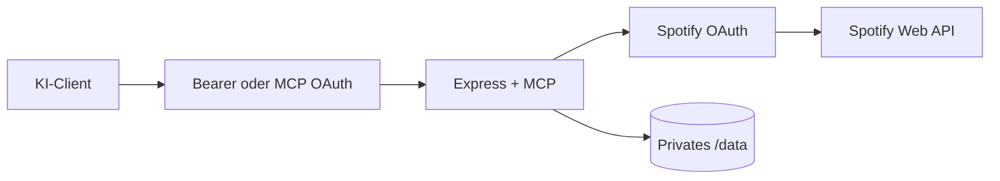

# Architektur

`src/index.ts` startet Express und MCP. `src/mcp/tools.ts` und `src/mcp/helpers.ts` registrieren 39 Tools. `src/spotify/client.ts` behandelt Timeouts, sichere Retries und Fehlernormalisierung. Der Transport ist stateless; dauerhaft sind nur verschlüsselte Spotify-Tokens und MCP-OAuth-Daten.
