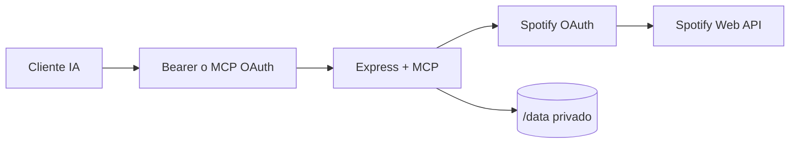

# Arquitectura

`src/index.ts` inicia Express y MCP; `src/mcp/tools.ts` y `src/mcp/helpers.ts` registran 39 herramientas; `src/spotify/client.ts` gestiona timeouts, reintentos seguros y errores. El transporte es stateless y el almacenamiento persistente se limita a tokens Spotify cifrados y datos MCP OAuth.
