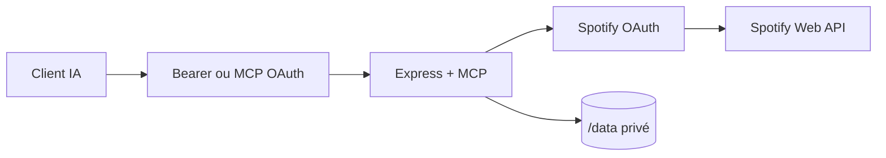

# Architecture

`src/index.ts` lance Express et MCP; `src/mcp/tools.ts` et `src/mcp/helpers.ts` enregistrent 39 outils; `src/spotify/client.ts` gère les timeouts, retries sûrs et erreurs. Le transport est stateless et le stockage durable se limite aux tokens Spotify chiffrés et aux données MCP OAuth.
