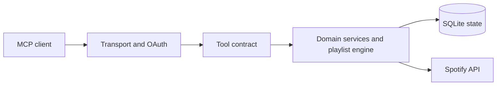

## From a request to a safe operation

JamRelay is not Spotify's official Daily Mix or recommendation product. It is a self-hosted automation layer that turns high-level requests into bounded Spotify operations.

## Choose your path

- [Quick start](/getting-started) — connect Spotify and invoke a safe read tool.
- [Playlist automation](/playlist-automation) — analysis, layout, cleanup and composition.
- [Safety model](/playlist-safety) — snapshots, verification and undo guarantees.
- [Database-first resolution](/database-first-resolution) — how local canonical state reduces Search usage.
- [Generated tool reference](/tools-reference) — exact runtime schemas and annotations.

## What JamRelay knows

It can use Spotify responses, local canonical track state, persisted jobs, snapshots and playback/history events that JamRelay actually observed or synchronized. It does not invent dislikes, complete listening history or recommendation preferences. See [personalization limits](/playlist-personalization).
