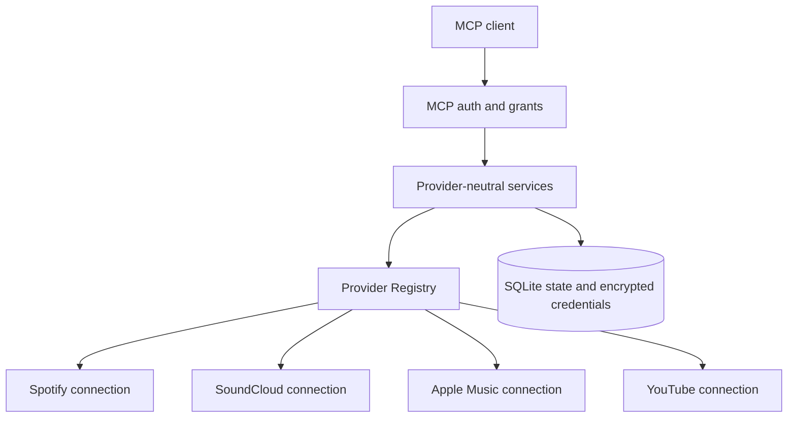

## What JamRelay is

JamRelay is a self-hosted, provider-neutral music automation MCP server. It
connects MCP clients to provider adapters and turns high-level requests into
bounded, explainable operations. Spotify is a supported provider, not the
architecture: a fresh instance may boot with zero configured providers and
provider connectivity is separate from server health.

## Choose a path

- **Local user:** [installation](/installation) → [getting started](/getting-started) → [provider connections](/provider-connections).
- **MCP client user:** [client setup](/clients/) → [MCP authentication](/oauth) → [tools and workflows](/tools).
- **VPS operator:** [deployment](/deployment/free-hosting) → [configuration](/configuration) → [release audit](/release-audit).
- **Developer:** [architecture](/architecture) → [state database](/state-database) → [development](/development).
- **Provider integrator:** [capabilities](/providers/capabilities) → [provider guides](/providers/) → [canonical resolution](/database-first-resolution).

## Architecture at a glance

Each `connection_id` identifies one authorized provider connection. Capabilities
describe what that connection can do. Reads can follow configured selection
rules; writes require one available, capable target and fail closed when the
target is missing or ambiguous. See [provider connections](/provider-connections)
and [security](/security).

## Feature map

- [Playlist automation](/playlist-automation), [safety and undo](/playlist-safety), and [chapters](/playlist-chapters)
- [Cross-provider transfer](/tools#transfer-workflows), [import/export](/playlist-import-export), and [canonical resolution](/database-first-resolution)
- [Authentication](/oauth), [Connection Hub](/provider-connections), and [ACLs](/clients/oauth-compatibility)
- [Persistence and migrations](/state-database), [operations](/operations), and [troubleshooting](/troubleshooting)

## Support boundaries

Spotify, SoundCloud, Apple Music and YouTube have different adapters and
capabilities; feature parity is not assumed. Apple Music requires a Music User
Token in addition to server-side developer credentials. YouTube represents
music as videos through the official YouTube Data API. TIDAL is feasibility-only
and is not an implemented provider. See [provider status](/providers/).
