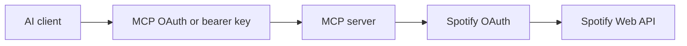

# JamRelay

Self-hosted MCP server for connecting AI assistants to your own Spotify account.

[Get started](/getting-started) · [Configuration](/configuration) · [MCP tools](/tools)

> **Unofficial project.** JamRelay is not affiliated with, endorsed by, or sponsored by Spotify, OpenAI, Anthropic, Google, or any other AI platform vendor. Spotify is a trademark of Spotify AB.

## What it does

JamRelay exposes Spotify search, library, playlist, discovery, and playback operations through the Model Context Protocol (MCP). You run the server, authorize your own Spotify account, and choose which client can reach it.

## Two independent authentication layers

1. **AI client → MCP server:** bearer API key or the built-in MCP OAuth authorization-code flow with PKCE.
2. **MCP server → Spotify:** Spotify OAuth authorization-code flow. The server stores encrypted Spotify tokens and refreshes them when needed.

## Highlights

- 39 read and write MCP tools based on the current implementation.
- Encrypted, atomic token persistence with local `./data` defaults and `/data` defaults in the production Docker image.
- OAuth state validation, PKCE, exact redirect URI allowlisting, and hashed MCP tokens.
- Local Node.js, Docker, Compose, reverse proxy, Cloudflare Tunnel, VPS, and NAS-friendly deployment guidance.
- English canonical documentation with Polish, German, French, and Spanish best-effort translations.
- Generated MCP tool and environment references to avoid duplicating fast-changing technical data across locales.

## Language selector

[English](/) · [Polski](/pl/) · [Deutsch](/de/) · [Français](/fr/) · [Español](/es/)

Start with the [quick start](/getting-started), then read [security](/security) before exposing the service to the internet. See the [translation policy](/translation-policy) for locale maintenance rules.
