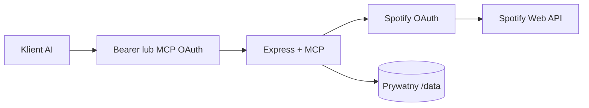

# Architektura

`src/index.ts` uruchamia Express i transport MCP. `src/mcp/tools.ts` oraz `src/mcp/helpers.ts` rejestrują narzędzia. `src/spotify/client.ts` obsługuje requesty, timeouty, retry bezpiecznych odczytów i normalizację błędów. `src/spotify/auth.ts` zarządza Spotify OAuth, a `src/mcp/oauth.ts` MCP OAuth.

Warstwa transportu MCP jest stateless. Stan trwały ogranicza się do zaszyfrowanych tokenów Spotify i zhashowanych rekordów MCP OAuth. Jedno wdrożenie używa jednego konta Spotify dla wszystkich uprawnionych klientów.
