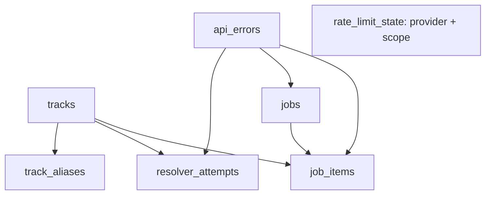

# TuneLink State Database

TuneLink uses SQLite for its first persistent state foundation because the production architecture currently runs one TuneLink application instance with one local persistent volume. SQLite provides durable local state, WAL concurrency for the app process, and very low operational overhead without adding a database service. A deployment with multiple independently scheduled replicas should revisit this model and likely move shared state to a network database such as PostgreSQL.

## Persistence architecture

```text
tunelink_app
    |
    v
/data/tunelink.db
    |
    v
Docker external volume: tunelink_data
```

The encrypted `spotify-token.json` and the MCP OAuth store remain separate files under `/data`. The SQLite database is state storage, not credential storage.

| Location             | Purpose                                         |
| -------------------- | ----------------------------------------------- |
| `/data/tunelink.db`  | Production database                             |
| `./data/tunelink.db` | Local development default                       |
| `db/migrations/`     | Versioned migration source shipped in the image |

`TUNELINK_DB_PATH`, when set, overrides `TUNELINK_DATA_DIR`. Otherwise the database is `${TUNELINK_DATA_DIR}/tunelink.db`; Compose sets `TUNELINK_DATA_DIR=/data`. Both variables are non-secret infrastructure configuration.

## SQLite configuration

Every application connection sets:

- `journal_mode=WAL`: allows readers while the writer appends to the WAL.
- `foreign_keys=ON`: enforces the declared relationships.
- `busy_timeout=5000`: waits briefly for another transaction instead of failing immediately.
- `synchronous=NORMAL`: a practical durability/performance balance for WAL mode.
- `wal_autocheckpoint=1000`: bounds WAL growth through SQLite checkpoints.

This is intentionally a single-process/local-volume design. It is not a distributed lock or multi-replica database solution.

## Schema in migration 0001

The first migration establishes the state model. Business writers and workers are deliberately wired in later phases.

| Table               | Purpose and relationships                                                                            |
| ------------------- | ---------------------------------------------------------------------------------------------------- |
| `schema_migrations` | Applied migration filenames and timestamps; managed by startup.                                      |
| `tracks`            | Canonical Spotify tracks and resolver metadata. Parent of aliases, attempts, and optional job items. |
| `track_aliases`     | Normalized title/artist/album lookup aliases for a track.                                            |
| `resolver_attempts` | Resolver diagnostics, strategy, outcome, confidence, and optional track/API error links.             |
| `api_errors`        | Fingerprinted provider errors with first/last occurrence data, counts, and normalized details.       |
| `rate_limit_state`  | Provider/scope blocking and retry state; standalone from track identity.                             |
| `jobs`              | Durable future work records, status, scheduling, attempts, and optional last error.                  |
| `job_items`         | Per-item durable job progress; belongs to `jobs`, and may reference a track or API error.            |



The intended future error path is `Spotify HTTP client → normalized API error → api_errors → rate_limit_state → durable job scheduling`. The tables are prepared for this design; that middleware and worker behavior is not implemented in this foundation release.

## Migration lifecycle

On startup, the application creates the data directory, opens SQLite, applies the PRAGMAs, and discovers SQL files in deterministic filename order. Each unapplied migration runs once inside a transaction and is recorded in `schema_migrations` only after success. A migration failure rolls back its transaction and aborts startup, so the HTTP server does not become healthy. There are no automatic DOWN migrations.

Migrations are forward-only and must use expand/contract compatibility:

1. **Expand:** add compatible schema first.
2. **Deploy:** the new application begins using it.
3. **Contract:** perform destructive cleanup only in a later release after old images no longer need the compatibility window.

Application rollback is not database rollback. A migration must not make the immediately previous image unable to run if the deployment pipeline needs to restore that image.

Migration filenames are the canonical schema order and must match `^[0-9]{4}_[a-z0-9][a-z0-9_-]*\.sql$`, for example `0002_add_track_isrc.sql`. Numeric prefixes must be unique. Applied history is immutable: the runner stores the exact file's lowercase 64-character SHA-256 checksum and verifies it on every startup. A changed or missing applied file is schema drift and fails startup; the stored checksum is never silently rewritten.

The registry has the following shape:

```sql
schema_migrations (
  version TEXT PRIMARY KEY,
  checksum TEXT NOT NULL,
  applied_at INTEGER NOT NULL
)
```

`currentVersion` is the newest applied migration and `expectedVersion` is the newest migration shipped in the current build. A healthy process reports both through `/health` and they must match. Missing migrations are applied automatically during startup, once, in order. The deploy script independently derives the expected version from the repository and compares it with the running health response; it does not read or mutate SQLite directly.

### Creating a migration

```bash
npm run db:migration:new -- add-track-isrc
```

This developer-only command creates the next empty, forward-only migration file, such as `db/migrations/0002_add_track_isrc.sql`. It does not connect to a database, infer SQL, or apply anything. Write and review the SQL, commit the migration together with the compatible application code, and never edit a migration that has been applied in shared or production storage. Create `0002_add_track_isrc.sql` instead of editing `0001_state_db.sql`.

Production does not auto-generate migrations because intent cannot be inferred safely: `ADD`, `RENAME`, `DROP`, and compatibility constraints require human review. Migration files in Git are the sole authority. There is no production schema auto-diff or automatic repair.

### Deployment verification

```text
repository expected migration
        ↓
new image startup
        ↓
missing migrations applied
        ↓
health exposes current schema
        ↓
deploy compares expected/current
        ↓
success or application rollback
```

If startup or schema verification fails, the application does not become healthy and the existing deployment rollback can restore the application image. The database remains forward-only: deployment never runs a DOWN migration, restores an old SQLite file, or rolls back the database. This is why the expand/deploy/contract policy is mandatory.

### Schema drift protection

TuneLink detects an applied migration whose checksum changed, an applied migration whose file disappeared, an invalid or ambiguous migration filename, a migration execution failure, and a current/expected schema mismatch. A legacy `schema_migrations` table from the first foundation release is upgraded additively and receives the checksum only when its applied version still exists in the repository; unknown versions fail conservatively.

## Backup, recovery, and security

No automated backup command is implemented. Do not copy only `tunelink.db` while the app may be writing its WAL; use an application-aware SQLite backup procedure or stop the app before making a filesystem-level backup that includes the database and its `-wal`/`-shm` files. Recovery requires restoring matching `/data` contents and environment configuration, then starting the app.

The database must not contain Spotify access or refresh tokens, the Cloudflare tunnel token, client secrets, arbitrary `.env` values, raw authorization headers, full HTTP bodies, or full analytics request history. API error records are designed for normalized diagnostics and hashes rather than secret payloads.

## Troubleshooting

- **Cannot open / permission error:** verify that the runtime user can write `/data` and that `TUNELINK_DB_PATH` points to a writable location.
- **Migration failure:** inspect application startup logs and fix the migration/schema issue; health should remain unavailable until startup succeeds.
- **Corruption:** stop the app, preserve the original database and WAL files, and restore a known-good backup before restarting.
- **WAL files:** `tunelink.db-wal` and `tunelink.db-shm` are normal SQLite companion files and are ignored by Git.
- **Schema inspection:** read-only inspection of `schema_migrations` confirms which migration filenames were applied.
- **Local reset:** stop the local app and remove only the local `data/` database files when intentionally resetting development state. Never use a destructive reset against the production `tunelink_data` volume.

Recreating `tunelink_app` does not delete the external `tunelink_data` volume. The deployment script packages and ships migration source but does not run migrations itself; normal application startup owns that responsibility. A failed migration therefore prevents healthy state and lets deployment health/rollback react.
