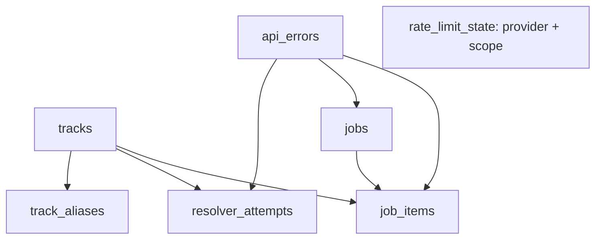

# TuneLink State Database

TuneLink uses SQLite for its first persistent state foundation because the production architecture currently runs one TuneLink application instance with one local persistent volume. SQLite provides durable local state, WAL concurrency for the app process, and very low operational overhead without adding a database service. A deployment with multiple independently scheduled replicas should revisit this model and likely move shared state to a network database such as PostgreSQL.

## Persistence architecture

```text
tunelink_app
    |
    v
/data/tunelink.db
    |
    v
Docker external volume: tunelink_data
```

The encrypted `spotify-token.json` and the MCP OAuth store remain separate files under `/data`. The SQLite database is state storage, not credential storage.

| Location             | Purpose                                         |
| -------------------- | ----------------------------------------------- |
| `/data/tunelink.db`  | Production database                             |
| `./data/tunelink.db` | Local development default                       |
| `db/migrations/`     | Versioned migration source shipped in the image |

`TUNELINK_DB_PATH`, when set, overrides `TUNELINK_DATA_DIR`. Otherwise the database is `${TUNELINK_DATA_DIR}/tunelink.db`; Compose sets `TUNELINK_DATA_DIR=/data`. Both variables are non-secret infrastructure configuration.

## SQLite configuration

Every application connection sets:

- `journal_mode=WAL`: allows readers while the writer appends to the WAL.
- `foreign_keys=ON`: enforces the declared relationships.
- `busy_timeout=5000`: waits briefly for another transaction instead of failing immediately.
- `synchronous=NORMAL`: a practical durability/performance balance for WAL mode.
- `wal_autocheckpoint=1000`: bounds WAL growth through SQLite checkpoints.

This is intentionally a single-process/local-volume design. It is not a distributed lock or multi-replica database solution.

## Schema in migration 0001

The first migration establishes the state model used by the runtime resolver, API diagnostics, rate-limit guard, and durable single-worker jobs. Migration `0001_state_db.sql` is immutable; phase metadata is stored in `jobs.payload_json`.

| Table               | Purpose and relationships                                                                            |
| ------------------- | ---------------------------------------------------------------------------------------------------- |
| `schema_migrations` | Applied migration filenames and timestamps; managed by startup.                                      |
| `tracks`            | Canonical Spotify tracks and resolver metadata. Parent of aliases, attempts, and optional job items. |
| `track_aliases`     | Normalized title/artist/album lookup aliases for a track.                                            |
| `resolver_attempts` | Resolver diagnostics, strategy, outcome, confidence, and optional track/API error links.             |
| `api_errors`        | Fingerprinted provider errors with first/last occurrence data, counts, and normalized details.       |
| `rate_limit_state`  | Provider/scope blocking and retry state; standalone from track identity.                             |
| `jobs`              | Durable future work records, status, scheduling, attempts, and optional last error.                  |
| `job_items`         | Per-item durable job progress; belongs to `jobs`, and may reference a track or API error.            |



The runtime error path is `Spotify HTTP client → normalized API error → api_errors → rate_limit_state → resolver/job result`. Error fingerprints are SHA-256 hashes of normalized provider, method, endpoint path, status, and provider reason; volatile request IDs and retry values are excluded. Repeated errors update `last_seen_at`, `occurrences`, and the newest useful retry metadata instead of inserting duplicate rows.

Spotify rate limits are persisted per provider and scope. `/search` uses scope `search`; playlist and player endpoints use their normalized endpoint scope, so a search quota block does not unnecessarily disable playlist writes. A 429 is recorded, converted to `blocked_until` using `ceil(Retry-After)`, and returned immediately. Future requests preflight this state before authentication/network I/O, including after an application restart; no request sleeps for the Spotify cooldown.

Track resolution is database-first: normalized title/artist/album aliases are checked before Spotify Search. A confident search match upserts canonical track metadata and the input alias; cache hits increment `hit_count` and update `last_used_at`. Ambiguous and unmatched results never create aliases, and alias collisions are surfaced conservatively rather than overwritten. Bulk resolution coalesces duplicate normalized queries and creates a durable job when a persisted rate limit prevents completion. `get_job_status`, `list_jobs`, `resume_job`, `commit_job`, `cancel_job`, `get_state_diagnostics`, `get_rate_limit_status`, and `get_recent_api_errors` are authenticated MCP tools; item inspection is paginated and bounded.

## Durable job runtime

Job phase is stored in `jobs.payload_json.phase`:

| Phase | Meaning |
| --- | --- |
| `created` | Job and ordered `job_items` are persisted. |
| `resolving` | The in-process single worker is resolving a bounded batch. |
| `waiting_rate_limit` | Resolution waits for the persisted Spotify scope block; `jobs.status` is `waiting` and `run_after` is the eligibility time. |
| `ready_to_commit` | Required items are resolved and explicit commit is allowed. |
| `committing` | Commit metadata is durable and the Spotify mutation is in progress. |
| `completed` | The mutation succeeded, or a dry-run completed without mutation. |
| `failed` | Processing or commit failed; `manual_review=true` may be present. |

Normal batch progress and rate-limit waiting do not consume `attempts`; only actual retryable processing failures do. `max_attempts` stops automatic processing and marks the job failed.

On startup, interrupted resolution jobs return to `pending` and resume from persisted item progress. A job with phase `committing` is never automatically re-queued: recovery marks it failed with `manual_review=true` and preserves commit metadata. Spotify mutations have no exactly-once guarantee; uncertain transport outcomes are not blindly retried.

Deferred commits preserve `strict`, `dry_run`, `skip_existing`, and `skip_duplicates`. Dry runs perform no Spotify mutation; `skip_existing` is re-evaluated at commit time; duplicates are removed without changing requested order; and items are reconstructed by `job_items.position`. Strict jobs cannot commit unresolved, ambiguous, or failed items. Playlist creation is deferred until commit.

## Migration lifecycle

On startup, the application creates the data directory, opens SQLite, applies the PRAGMAs, and discovers SQL files in deterministic filename order. Each unapplied migration runs once inside a transaction and is recorded in `schema_migrations` only after success. A migration failure rolls back its transaction and aborts startup, so the HTTP server does not become healthy. There are no automatic DOWN migrations.

Migrations are forward-only and must use expand/contract compatibility:

1. **Expand:** add compatible schema first.
2. **Deploy:** the new application begins using it.
3. **Contract:** perform destructive cleanup only in a later release after old images no longer need the compatibility window.

Application rollback is not database rollback. A migration must not make the immediately previous image unable to run if the deployment pipeline needs to restore that image.

Migration filenames are the canonical schema order and must match `^[0-9]{4}_[a-z0-9][a-z0-9_-]*\.sql$`, for example `0002_add_track_isrc.sql`. Numeric prefixes must be unique. Applied history is immutable: the runner stores the exact file's lowercase 64-character SHA-256 checksum and verifies it on every startup. A changed or missing applied file is schema drift and fails startup; the stored checksum is never silently rewritten.

The registry has the following shape:

```sql
schema_migrations (
  version TEXT PRIMARY KEY,
  checksum TEXT NOT NULL,
  provenance TEXT NOT NULL,
  applied_at INTEGER NOT NULL
)
```

New rows use `provenance=verified`. A checksum-less legacy registry is upgraded additively with `provenance=legacy_backfilled`; this records that the checksum was computed from the current repository file and is not historical proof of the bytes that originally ran. Unknown legacy versions fail closed.

`currentVersion` is the newest applied migration and `expectedVersion` is the newest migration shipped in the current build. The database reports `schemaState` as `current`, `ahead`, or `behind`. A healthy current release is `current`; an older rollback image may safely be `ahead` when all migrations known to that image are present and verified. Missing migrations are applied automatically during startup, once, in order, only when the database is not already ahead. The deploy script independently derives the expected version from the repository and compares it with the new running health response; it does not read or mutate SQLite directly.

### Rollback compatibility example

Release N ships `0001`. Release N+1 ships `0001` and `0002`, and applies `0002`. If a later deployment check fails, the application image can roll back to Release N while the DB remains at `0002`. Release N is allowed to start because its known `0001` checksum still matches and `0002` has a newer numeric prefix than its highest known migration. The expand/deploy/contract policy guarantees that the old application remains compatible with the additive schema. Release N cannot cryptographically verify unknown `0002`, because that file is not in its image; it verifies every migration it does know.

If the DB contains a future migration, the older build must already have every migration it knows applied; it never applies a known migration retroactively underneath the future state. A missing local migration with a prefix at or below the build's latest prefix remains fatal. Malformed applied version metadata and known checksum mismatches remain fatal.

Deployment uses two health checks. A new release must report the repository's expected `schemaVersion`. Rollback health only requires the stable pre-DB baseline (`status=ok` and `spotifyConnected=true`); it does not require the previous image to expose `database` fields or to report the new release's schema version. The rollback image's own startup verification decides whether its known migrations are compatible with the forward database.

### Creating a migration

```bash
npm run db:migration:new -- add-track-isrc
```

This developer-only command creates the next empty, forward-only migration file, such as `db/migrations/0002_add_track_isrc.sql`. It does not connect to a database, infer SQL, or apply anything. Write and review the SQL, commit the migration together with the compatible application code, and never edit a migration that has been applied in shared or production storage. Create `0002_add_track_isrc.sql` instead of editing `0001_state_db.sql`.

Production does not auto-generate migrations because intent cannot be inferred safely: `ADD`, `RENAME`, `DROP`, and compatibility constraints require human review. Migration files in Git are the sole authority. There is no production schema auto-diff or automatic repair.

### Deployment verification

```text
repository expected migration
        ↓
new image startup
        ↓
missing migrations applied
        ↓
health exposes current schema
        ↓
deploy compares expected/current
        ↓
success or application rollback
```

If startup or schema verification fails, the application does not become healthy and the existing deployment rollback can restore the application image. The database remains forward-only: deployment never runs a DOWN migration, restores an old SQLite file, or rolls back the database. This is why the expand/deploy/contract policy is mandatory.

### Schema drift protection

TuneLink detects an applied migration whose checksum changed, an applied migration whose file disappeared, an invalid or ambiguous migration filename, a migration execution failure, and a current/expected schema mismatch. A legacy `schema_migrations` table from the first foundation release is upgraded additively and receives the checksum only when its applied version still exists in the repository; unknown versions fail conservatively.

## Backup, recovery, and security

No automated backup command is implemented. Do not copy only `tunelink.db` while the app may be writing its WAL; use an application-aware SQLite backup procedure or stop the app before making a filesystem-level backup that includes the database and its `-wal`/`-shm` files. Recovery requires restoring matching `/data` contents and environment configuration, then starting the app.

The database must not contain Spotify access or refresh tokens, the Cloudflare tunnel token, client secrets, arbitrary `.env` values, raw authorization headers, full HTTP bodies, or full analytics request history. API error records are designed for normalized diagnostics and hashes rather than secret payloads.

Migration files use LF line endings through `.gitattributes` (`*.sql text eol=lf`) so Windows and Linux checkouts hash the same SQL bytes.

## Troubleshooting

- **Cannot open / permission error:** verify that the runtime user can write `/data` and that `TUNELINK_DB_PATH` points to a writable location.
- **Migration failure:** inspect application startup logs and fix the migration/schema issue; health should remain unavailable until startup succeeds.
- **Corruption:** stop the app, preserve the original database and WAL files, and restore a known-good backup before restarting.
- **WAL files:** `tunelink.db-wal` and `tunelink.db-shm` are normal SQLite companion files and are ignored by Git.
- **Schema inspection:** read-only inspection of `schema_migrations` confirms which migration filenames were applied.
- **Local reset:** stop the local app and remove only the local `data/` database files when intentionally resetting development state. Never use a destructive reset against the production `tunelink_data` volume.

Recreating `tunelink_app` does not delete the external `tunelink_data` volume. The deployment script packages and ships migration source but does not run migrations itself; normal application startup owns that responsibility. A failed migration therefore prevents healthy state and lets deployment health/rollback react.
